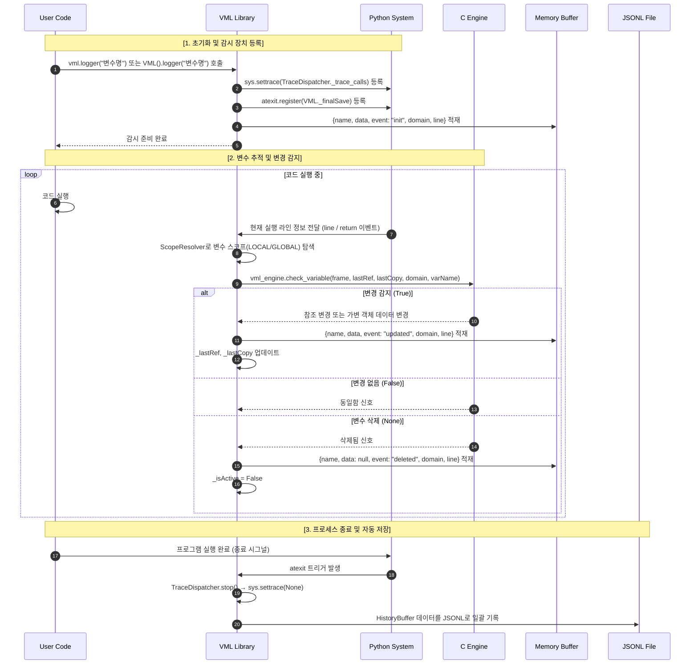

# Variable Monitoring Logger (VML)

> Python 프로그램 실행 중 변수의 값 변화를 자동으로 감지하고 기록하는 모니터링 라이브러리

[](https://pypi.org/project/vmlog/)
[](https://pypi.org/project/vmlog/)
[](./LICENSE)

---

## 개요

Python 코드에서 변수의 상태 변화를 확인하려면 일반적으로 `print`문을 추가하거나 디버거를 사용해야 합니다.  
하지만 이 방식은 코드 가독성을 해치고, 실행 흐름을 방해하며, 시스템 규모가 커질수록 유지보수를 어렵게 만듭니다.

**VML**은 이러한 문제를 해결하기 위해 변수의 변경 여부를 백그라운드에서 자동으로 감지하고,  
프로그램 종료 시 그 이력을 JSONL 로그 파일로 안전하게 기록합니다.

---

## 특징

| 특징 | 설명 |
|------|------|
| **무결성 유지** | 별도의 로그 함수 호출 없이 변수 변경을 자동 추적 |
| **고성능 로깅** | C Extension 기반의 참조 및 값 비교 연산으로 Python 레벨 오버헤드 최소화 |
| **I/O 최적화** | 메모리 버퍼(`HistoryBuffer`) 기반 로그 수집으로 잦은 디스크 접근 방지 |
| **안전한 기록** | 프로세스 종료 시(`atexit`) JSONL 형식의 로그 파일 자동 생성 |
| **Fail-Fast 설계** | C 엔진 누락 시 즉각적인 예외 처리로 견고한 실행 환경 보장 |

---

## 설치

```bash
# 일반 설치
pip install vmlog

# 개발자 모드 설치 (C Extension 모듈 빌드 포함)
pip install -e .

# C 확장 모듈 직접 빌드
python setup.py build_ext --inplace
```

**요구 사항**
- Python 3.11 이상
- C 컴파일러 (GCC, Clang, MSVC 등)

---

## 사용법

### 단일 변수 추적

```python
import vml

target = [1, 2, 3]
monitor = vml.logger("target")

target.append(4)
target = "String Assignment"
```

### 여러 변수 동시 추적

```python
import vml

first = [1]
second = "alpha"

monitor = vml.VML("vml_log.jsonl")
monitor.logger("first")
monitor.logger("second")

first.append(2)
second = "beta"
```

`vml.logger("변수명")` 또는 `VML` 인스턴스의 `.logger()` 메서드로 등록된 변수는 별도 조작 없이 생명주기 동안 자동으로 추적됩니다.  
기존 Python 문법과 런타임 실행 흐름을 100% 유지합니다.

---

## 로그 형식

로그는 JSON Lines(`.jsonl`) 형식으로 저장됩니다.  
하나의 JSON 객체는 하나의 변수 변경 이력을 의미합니다.

```json
{"name": "target", "data": [1, 2, 3], "event": "init", "domain": "LOCAL", "line": 3}
{"name": "target", "data": [1, 2, 3, 4], "event": "updated", "domain": "LOCAL", "line": 5}
{"name": "target", "data": "String Assignment", "event": "updated", "domain": "LOCAL", "line": 6}
{"name": "target", "data": null, "event": "deleted", "domain": "LOCAL", "line": 7}
```

| 필드 | 타입 | 설명 |
|------|------|------|
| `name` | string | 추적 중인 변수명 |
| `data` | any \| null | 변경 시점의 변수 값 (`deleted` 이벤트는 `null`) |
| `event` | string | `init` / `updated` / `deleted` |
| `domain` | string | 변수 스코프: `LOCAL` / `GLOBAL` |
| `line` | int \| null | 변경이 감지된 소스 코드 라인 번호 |

이 형식은 대용량 로그 처리와 스트리밍 파싱에 적합합니다.

---

## 아키텍처

Python tracer를 통해 실행 흐름을 관찰하고, 변수 변경 여부 판단은 C 엔진에 위임하여 성능을 유지합니다.



---

## 디렉토리 구조

```
.
├── .gitignore
├── LICENSE                          # MIT LICENSE
├── README.md
├── pyproject.toml
├── setup.py
├── tests/
│   ├── test.py                      # 테스트 러너 (unittest discover)
│   ├── test_logger.py               # 공개 API(vml.logger) 통합 테스트
│   ├── test_vml_behavior.py         # 변수 추적 동작 시나리오 테스트
│   ├── test_vml_components.py       # 내부 컴포넌트 단위 테스트
│   ├── test_vml_edge_cases.py       # 엣지 케이스 및 경계 조건 테스트
│   ├── test_vml_engine.py           # C Extension 엔진 단위 테스트
│   └── test_vml_process_lifecycle.py # atexit 기반 프로세스 생명주기 테스트
└── src/
    └── vml/                         # VML Package
        ├── __init__.py              # 공개 API 노출 (VML, logger, vml_engine)
        ├── vml.py                   # VML 메인 클래스 및 logger() 진입점
        ├── FileWriter.py            # JSONL 파일 I/O
        ├── HistoryBuffer.py         # 메모리 버퍼 관리 (domain, line 포함)
        ├── ScopeResolver.py         # 변수 스코프(LOCAL/GLOBAL) 탐색
        ├── TraceDispatcher.py       # 시스템 Trace 이벤트 라우팅 및 추적 관리
        ├── VariableTracker.py       # 개별 변수 상태 추적 및 스냅샷 관리
        └── vml_engine.c             # C Extension 변수 비교 엔진
```

---

## 테스트

```bash
python tests/test.py
```

`unittest discover` 기반으로 `tests/` 디렉토리의 모든 `test_*.py` 파일을 자동으로 수집하여 실행합니다.

```
test_final_save_is_idempotent (test_vml_components.TestVMLComponents) ... ok
test_file_writer_writes_json_lines (test_vml_components.TestVMLComponents) ... ok
test_history_buffer_clear (test_vml_components.TestVMLComponents) ... ok
test_history_buffer_returns_deepcopy (test_vml_components.TestVMLComponents) ... ok
test_scope_resolver_finds_global_variable (test_vml_components.TestVMLComponents) ... ok
test_scope_resolver_finds_local_variable_first (test_vml_components.TestVMLComponents) ... ok
test_scope_resolver_returns_not_found (test_vml_components.TestVMLComponents) ... ok
test_vml_records_deleted_event (test_vml_components.TestVMLComponents) ... ok
test_dispatcher_stop_prevents_further_tracking (test_vml_edge_cases.TestVMLEdgeCases) ... ok
test_local_variable_has_priority_over_global_name_collision (test_vml_edge_cases.TestVMLEdgeCases) ... ok
test_no_duplicate_update_when_value_does_not_change (test_vml_edge_cases.TestVMLEdgeCases) ... ok
test_tracks_common_scalar_and_tuple_reassignments (test_vml_edge_cases.TestVMLEdgeCases) ... ok
test_tracks_nested_mutable_object_change (test_vml_edge_cases.TestVMLEdgeCases) ... ok
test_unicode_data_is_written_without_corruption (test_vml_edge_cases.TestVMLEdgeCases) ... ok
test_returns_false_when_value_does_not_change (test_vml_engine.TestVMLEngine) ... ok
test_returns_none_when_variable_does_not_exist (test_vml_engine.TestVMLEngine) ... ok
test_returns_true_when_mutable_data_changes (test_vml_engine.TestVMLEngine) ... ok
test_returns_true_when_reference_changes (test_vml_engine.TestVMLEngine) ... ok
test_atexit_saves_log_without_manual_final_save (test_vml_process_lifecycle.TestVMLProcessLifecycle) ... ok
test_atexit_saves_multiple_variables_from_single_monitor (test_vml_process_lifecycle.TestVMLProcessLifecycle) ... ok
test_process_log_uses_jsonl_schema_after_exit (test_vml_process_lifecycle.TestVMLProcessLifecycle) ... ok
test_return_event_captures_last_change_inside_function (test_vml_process_lifecycle.TestVMLProcessLifecycle) ... ok
...

----------------------------------------------------------------------
Ran N tests in X.XXXs

OK
```

---

## 라이선스

[MIT](./LICENSE) © sdkurjnk