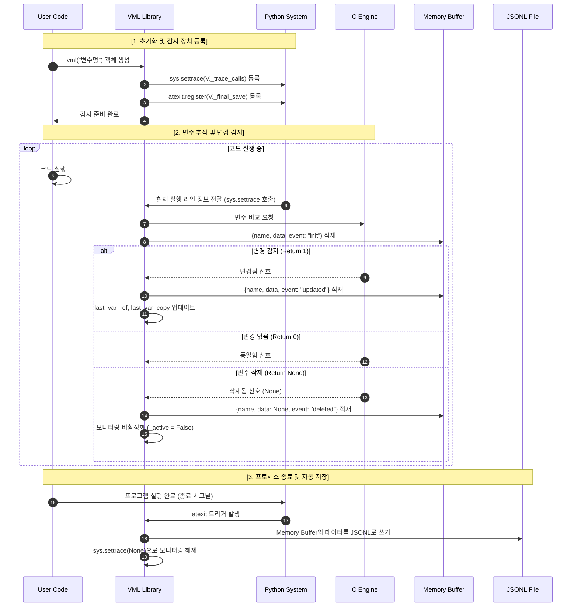

Variable Monitoring Logger (VML)
===

Variable Monitoring Logger(VML)는 Python 프로그램 실행 중
변수의 값 변화를 자동으로 감지하고 기록하기 위한 모니터링 라이브러리입니다.

기존의 print 디버깅이나 반복적인 중단점 설정 없이,
코드 수정 없이 변수 변화 이력을 파일로 남기는 것을 목표로 합니다.

---

## Overview

Python 코드에서 변수의 상태 변화를 확인하려면 일반적으로
출력문을 추가하거나 디버거를 사용해야 합니다.
이 방식은 코드 가독성을 해치고, 실행 흐름을 방해하며,
규모가 커질수록 유지보수가 어려워집니다.

VML은 이러한 문제를 해결하기 위해
변수의 변경 여부를 자동으로 감지하고
프로그램 종료 시 로그 파일로 기록하는 방식을 제공합니다.

---

## Features

- 코드 수정 없이 변수 변경 자동 추적
- C Extension 기반 참조/값 비교로 Python-level 비교 오버헤드 최소화
- 메모리 버퍼 기반 로그 수집으로 I/O 최소화
- 실행 종료 시 자동 로그 파일 생성
- 다수의 변수 모니터링에도 안정적인 성능 유지

---

## Usage

VML 라이브러리만 불러오면 별도의 설정 없이 사용할 수 있습니다.

```python
from vml import vml

A = [1, 2, 3]
monitor_A = vml("A")
```
monitor_A 객체는 별도로 사용하지 않아도 되며, 생명주기 동안 자동으로 추적됩니다.

- 별도의 로그 함수 호출 불필요
- 변수 값이 변경되면 자동으로 기록
- 기존 Python 문법 및 실행 흐름 유지

---

## Design

Python 레벨에서 매 라인마다 변수 상태를 비교하는 방식의 오버헤드를 줄이기 위해, 변수 변경 여부 판단 로직을 C Extension 엔진으로 분리하여 처리합니다.

즉, Python tracer를 통해 실행 흐름을 관찰하고, 변수 변경 여부 판단 자체는 C 엔진에 위임하여 성능을 유지합니다.



---

## Log Format

로그는 JSON Lines(.jsonl) 형식으로 저장됩니다.
하나의 JSON 객체는 하나의 변수 변경 이력을 의미합니다.

```json
{"name" : "A", "data" : [1, 2, 3], "event" : "init"}
{"name" : "A", "data" : [1, 2, 3, 4], "event" : "updated"}
{"name" : "A", "data" : null, "event" : "deleted"}
```

이 형식은 대용량 로그 처리와 스트리밍 파싱에 적합합니다.

---

## Requirements

Python 3.11 이상

C 컴파일러 (GCC, Clang, MSVC 등)

---

## Installation

제공된 테스트 코드를 실행하고자 하는 경우, 다음과 같은 명령어로 설치하면 됩니다.

```bash
$ pip install -e .
```

또는 C 확장 모듈을 직접 빌드할 수 있습니다.

```bash
$ python setup.py build_ext --inplace
```

단순히 패키지 사용만을 원하는 것이라면 다음 명령어로 설치하면 됩니다.
```bash
$ pip install .
```

---

## Project Structure
```bash
.
├── pyproject.toml
├── setup.cfg
├── setup.py
├── test/
└── src/
  └── vml/
   ├── __init__.py
   ├── logger.py (Python tracer & wrapper)
   └── vml_engine.c (C-based detection engine)
```

---

## Purpose

이 프로젝트는 다음을 목표로 합니다.

- Python 런타임 환경에서의 변수 추적 자동화

- 디버깅 과정의 반복 작업 감소

- 성능을 고려한 실사용 가능한 모니터링 도구 제공