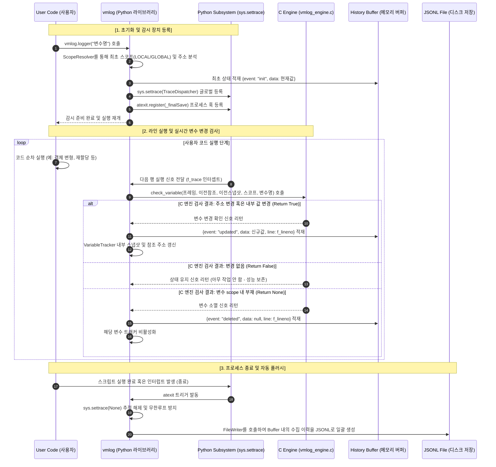

# vmlog

> Python 프로그램 실행 중 변수의 값 변화를 자동으로 감지하고 기록하는 모니터링 라이브러리

[](https://pypi.org/project/vmlog/)
[](https://pypi.org/project/vmlog/)
[](./LICENSE)

---

## 1. Overview

대규모 시스템이나 복잡한 알고리즘을 디버깅할 때 변수의 상태 변화를 확인하는 것은 필수적입니다. 그러나 일반적인 디버깅 방식은 다음과 같은 한계를 가집니다:
- **코드 오염:** 임시로 작성한 출력문(`print`)이 비즈니스 로직과 섞여 가독성을 해치고, 제거 누락 시 프로덕션 환경에 악영향을 줍니다.
- **실행 흐름 방해:** 대화형 디버거(PDB, IDE 디버거)는 루프나 고빈도 함수 내에서 실행을 멈추기 때문에 전체적인 시스템의 런타임 흐름을 유기적으로 관찰하기 어렵습니다.

`vmlog`는 이러한 문제를 해결하기 위해 **런타임 오버헤드를 최소화한 백그라운드 실시간 변수 추적 아키텍처**를 제공합니다. 사용자는 소스 코드 오염 없이 변수의 변경 여부를 자동으로 감지하고, 프로그램이 종료되는 시점에 수집된 모든 이력을 안전하게 디스크에 저장할 수 있습니다.

---

## 2. Features

- **무결성 및 투명성 (Zero-Invasive):** 최초 등록 이후 별도의 로그 매크로나 로깅 함수를 반복 호출할 필요가 없습니다. Python 고유의 실행 문법과 흐름을 100% 유지하며 백그라운드에서 추적합니다.
- **C Extension 기반 고성능 엔진:** 파이썬 레벨에서 매 라인마다 거대한 객체를 비교하는 비효율을 극복하기 위해, 가변/불변 객체 판별 및 메모리 참조·크기 비교 연산을 C 확장 모듈(`vmlog_engine`)로 처리하여 런타임 오버헤드를 극소화했습니다.
- **지연 쓰기 기반 I/O 최적화:** 변수가 바뀔 때마다 디스크에 접근하는 대신, 스레드-세이프한 메모리 버퍼(`HistoryBuffer`)에 로그를 적재한 후 최종 시점에 일괄 파일로 출력하여 디스크 I/O 병목을 방지합니다.
- **안전한 프로세스 생명주기 연동:** 프로그램이 정상 종료되거나 예기치 못한 예외로 중단되더라도, 내부 `atexit` 런타임 훅이 자동으로 트리거되어 유실 없이 파일 생성을 보장합니다.
- **지능적 스코프 해석 (Scope Resolution):** 실행 프레임 분석기를 통해 동일한 이름의 로컬 변수와 글로벌 변수가 충돌하거나, 로컬 변수가 글로벌 변수를 가리는(Shadowing) 현상을 정확히 해석합니다.

---

## 3. Installation

`vmlog`는 고성능 변수 비교를 위해 C 확장 모듈 컴파일이 필요합니다. 아래 명령어를 통해 환경에 맞게 설치할 수 있습니다.

### 개발자 모드 설치 (추천)
소스 코드를 수정하거나 테스트 슈트를 직접 구동하려는 경우, C 확장 모듈 빌드를 포함하여 편집 가능한 모드로 설치합니다:
```bash
pip install -e .
```

### 일반 패키지 설치
빌드 후 현재 환경에 고정 설치하려는 경우
```bash
pip install .
```

### C 확장 모듈 직접 빌드
```bash
python setup.py build_ext --inplace
```

**요구 사항**
- Python 3.11 이상
- C 컴파일러 (GCC, Clang, MSVC 등)

---

## 4. Usage

### 기본 사용법 (단일 변수 추적)
vmlog.logger 함수에 추적하고자 하는 변수의 이름을 문자열로 전달합니다.

```python
import Ocilo

# 1. 추적 대상 변수 생성
target_list = [100, 200]

# 2. 감시 장치 등록 (이 시점에 'init' 이벤트가 기록됩니다)
Ocilo.logger("target_list")

# 3. 변수 조작 (인플레이스 변경 및 재할당 모두 자동 감지)
target_list.append(300)

# 4. 변수 삭제 감지
del target_list

# 추가적인 라인이 실행되거나 프로그램이 종료될 때 상기 변경점들이 자동으로 기록됩니다.
```

### 고급 사용법
vmlog.VMlog 클래스를 인스턴스화하여 여러 개의 로컬/글로벌 변수를 동시에 모니터링하고 저장 파일명을 직접 지정할 수 있습니다.

```python
import Ocilo

# 커스텀 로그 파일명을 지정하여 모니터 인스턴스 생성
monitor = Ocilo.VMlog(fileName="analytics_dump.jsonl")

user_score = 10
active_items = ["potion", "shield"]

# 복수의 변수를 하나의 모니터에 등록
monitor.logger("user_score")
monitor.logger("active_items")

# 값 업데이트 진행
user_score += 55
active_items.append("sword")
```

`vmlog.logger("변수명")` 또는 `VMlog` 인스턴스의 `.logger()` 메서드로 등록된 변수는 별도 조작 없이 생명주기 동안 자동으로 추적됩니다.  
기존 Python 문법과 런타임 실행 흐름을 100% 유지합니다.

---

## 5. 로그 형식

로그는 JSON Lines(`.jsonl`) 형식으로 저장됩니다.  
하나의 JSON 객체는 하나의 변수 변경 이력을 의미합니다.

```json
{"name": "target", "data": [1, 2, 3], "event": "init", "domain": "LOCAL", "line": 3}
{"name": "target", "data": [1, 2, 3, 4], "event": "updated", "domain": "LOCAL", "line": 5}
{"name": "target", "data": "String Assignment", "event": "updated", "domain": "LOCAL", "line": 6}
{"name": "target", "data": null, "event": "deleted", "domain": "LOCAL", "line": 7}
```

| 필드 | 타입 | 설명 |
|------|------|------|
| `name` | string | 추적 중인 변수명 |
| `data` | any \| null | 변경 시점의 변수 값 (`deleted` 이벤트는 `null`) |
| `event` | string | `init` / `updated` / `deleted` |
| `domain` | string | 변수 스코프: `LOCAL` / `GLOBAL` |
| `line` | int \| null | 변경이 감지된 소스 코드 라인 번호 |

이 형식은 대용량 로그 처리와 스트리밍 파싱에 적합합니다.

---

## 6. Architecture

Python tracer를 통해 실행 흐름을 관찰하고, 변수 변경 여부 판단은 C 엔진에 위임하여 성능을 유지합니다.



---

## 7. File Structure

```
.
├── .gitignore
├── LICENSE                          # MIT LICENSE
├── README.md
├── pyproject.toml
├── setup.py
├── tests/
│   ├── test.py                      # 테스트 러너 (unittest discover)
│   ├── test_logger.py               # 공개 API(vml.logger) 통합 테스트
│   ├── test_vml_behavior.py         # 변수 추적 동작 시나리오 테스트
│   ├── test_vml_components.py       # 내부 컴포넌트 단위 테스트
│   ├── test_vml_edge_cases.py       # 엣지 케이스 및 경계 조건 테스트
│   ├── test_vml_engine.py           # C Extension 엔진 단위 테스트
│   └── test_vml_process_lifecycle.py # atexit 기반 프로세스 생명주기 테스트
└── src/
    └── vmlog/                       # VML Package
        ├── __init__.py              # 공개 API 노출 (VML, logger, vml_engine)
        ├── vmlog.py                 # VML 메인 클래스 및 logger() 진입점
        ├── FileWriter.py            # JSONL 파일 I/O
        ├── HistoryBuffer.py         # 메모리 버퍼 관리 (domain, line 포함)
        ├── ScopeResolver.py         # 변수 스코프(LOCAL/GLOBAL) 탐색
        ├── TraceDispatcher.py       # 시스템 Trace 이벤트 라우팅 및 추적 관리
        ├── VariableTracker.py       # 개별 변수 상태 추적 및 스냅샷 관리
        └── vmlog_engine.c             # C Extension 변수 비교 엔진
```

---

## 8. Test

```bash
python tests/test.py
```

`unittest discover` 기반으로 `tests/` 디렉토리의 모든 `test_*.py` 파일을 자동으로 수집하여 실행합니다.

```
test_final_save_is_idempotent (test_vml_components.TestVMLComponents) ... ok
test_file_writer_writes_json_lines (test_vml_components.TestVMLComponents) ... ok
test_history_buffer_clear (test_vml_components.TestVMLComponents) ... ok
test_history_buffer_returns_deepcopy (test_vml_components.TestVMLComponents) ... ok
test_scope_resolver_finds_global_variable (test_vml_components.TestVMLComponents) ... ok
test_scope_resolver_finds_local_variable_first (test_vml_components.TestVMLComponents) ... ok
test_scope_resolver_returns_not_found (test_vml_components.TestVMLComponents) ... ok
test_vml_records_deleted_event (test_vml_components.TestVMLComponents) ... ok
test_dispatcher_stop_prevents_further_tracking (test_vml_edge_cases.TestVMLEdgeCases) ... ok
test_local_variable_has_priority_over_global_name_collision (test_vml_edge_cases.TestVMLEdgeCases) ... ok
test_no_duplicate_update_when_value_does_not_change (test_vml_edge_cases.TestVMLEdgeCases) ... ok
test_tracks_common_scalar_and_tuple_reassignments (test_vml_edge_cases.TestVMLEdgeCases) ... ok
test_tracks_nested_mutable_object_change (test_vml_edge_cases.TestVMLEdgeCases) ... ok
test_unicode_data_is_written_without_corruption (test_vml_edge_cases.TestVMLEdgeCases) ... ok
test_returns_false_when_value_does_not_change (test_vml_engine.TestVMLEngine) ... ok
test_returns_none_when_variable_does_not_exist (test_vml_engine.TestVMLEngine) ... ok
test_returns_true_when_mutable_data_changes (test_vml_engine.TestVMLEngine) ... ok
test_returns_true_when_reference_changes (test_vml_engine.TestVMLEngine) ... ok
test_atexit_saves_log_without_manual_final_save (test_vml_process_lifecycle.TestVMLProcessLifecycle) ... ok
test_atexit_saves_multiple_variables_from_single_monitor (test_vml_process_lifecycle.TestVMLProcessLifecycle) ... ok
test_process_log_uses_jsonl_schema_after_exit (test_vml_process_lifecycle.TestVMLProcessLifecycle) ... ok
test_return_event_captures_last_change_inside_function (test_vml_process_lifecycle.TestVMLProcessLifecycle) ... ok
...

----------------------------------------------------------------------
Ran N tests in X.XXXs

OK
```

---

## License

[MIT](./LICENSE) © sdkurjnk