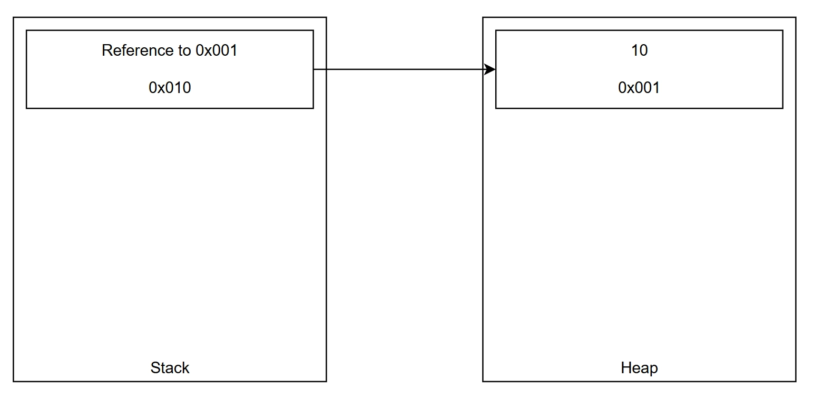
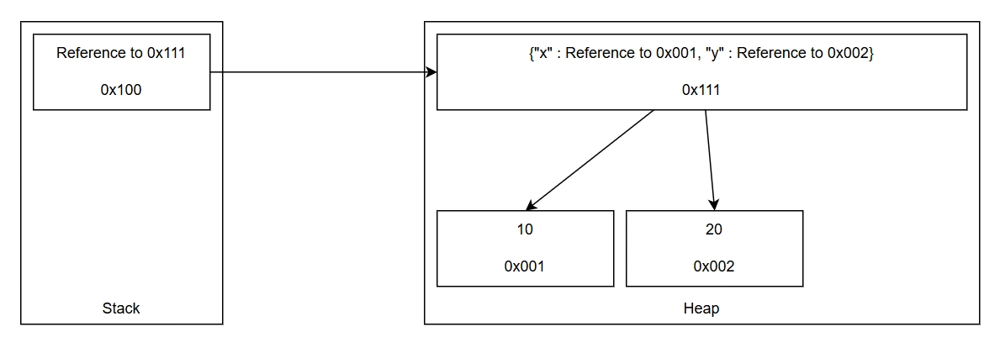

# 변경 감지 전략

매 라인마다 "이 변수가 바뀌었는가"를 판정하는 방식을 정리한다.

관련 코드: `VariableTracker.check`, `_make_state`, `oscilo_engine.c`

---

## 전제: 라인마다 실행된다

이 판정은 추적 대상 프레임의 **모든 실행 줄마다** 돈다. 따라서 판정 비용이 곧 도구 전체의 오버헤드다. 

핵심 설계 원칙은 "**싼 검사부터 시도해 비싼 검사 전에 결론을 낸다.**"이다.

## 참조 모델

파이썬 변수는 값이 아니라 **힙 객체를 가리키는 참조**다. 이름은 관념적으로 `{변수명: 참조}` 네임스페이스에서 관리되지만, 실제 저장 공간은 지역/전역에 따라 다르다.

**지역 변수**는 프레임의 `f_localplus`라는 정적 배열에 참조가 인덱스로 얹힌다. `x = 10`이면 배열의 해당 슬롯(`0x010`)이 힙의 `10` 객체(`0x001`)를 가리키는 포인터가 된다.



재할당은 힙을 덮어쓰지 않는다. C와 달리 파이썬은 `x = 20`에서 기존 객체에 20을 대입하지 않고, 새 객체를 힙에 만든 뒤 슬롯이 가리키는 참조를 그쪽으로 바꾼다. 슬롯(`f_localplus[index]`) 자체의 위치는 변하지 않는다.


**전역 변수**는 프레임에 담기지 않고 모듈 레벨의 `f_globals` 딕셔너리에서 `{변수명: 참조}`로 관리된다. 모든 함수가 봐야 하기 때문이다.



여기에 **가변성**이 겹친다. `int`·`str`처럼 불변인 객체는 힙에서 제자리 수정이 불가능하다 — 값을 바꾸는 유일한 길이 새 객체로의 재할당, 곧 참조 변경이다. 반대로 리스트·딕트처럼 가변인 객체는 참조를 그대로 둔 채 힙 내용만 바뀔 수 있다.

## 단축 평가 엔진

위 참조 모델을 판정 절차로 옮기면, 싼 검사부터 시도해 비싼 검사 전에 결론을 내는 네 단계가 나온다.

```
1. 참조 동일성이 바뀌었는가? -> 바뀜 (재할당 확정)
2. 불변 타입인가? -> 안 바뀜 (제자리 변경 불가)
3. 컨테이너 크기가 달라졌는가? -> 바뀜 (전체 비교 불필요)
4. 값을 비교한다 -> 바뀜 / 안 바뀜
```

1. **참조 동일성** — 모델에서 재할당은 반드시 슬롯의 참조를 바꾼다. 그래서 포인터 비교 한 번으로 재할당이 확정되고, 값을 볼 필요가 없다.
2. **불변 타입 조기 탈출** — 불변 객체는 제자리 수정이 불가능하므로, 1단계에서 참조가 그대로였다면 값도 그대로다. `int`, `str`, `float`, `bool`, `None`이 여기서 걸러지고, 가장 흔한 타입이라 탈출 비율이 높다.
3. **크기 비교** — 참조가 유지된 가변 객체만 여기까지 온다. 리스트·딕트·셋·튜플은 길이만으로 변경을 증명할 수 있어 O(1)로 O(n) 비교를 피한다. 단 크기가 같다고 값이 같은 건 아니라 "안 바뀜"을 확정하진 못한다.
4. **값 비교** — 참조도 크기도 같은 가변 객체가 마지막 관문이다. `PyObject_RichCompareBool`로 전체 비교하며, 여기까지 온 경우에만 O(n)을 지불한다.

## 파이썬 쪽 사전 분기

C 호출도 공짜가 아니므로 `VariableTracker.check`가 앞에서 한 번 더 거른다. 원자 타입(`int`, `float`, `bool`, `complex`, `str`, `bytes`, `None`)은 `_make_state`에서 스냅샷을 만들지 않으며, `state["copy"]`가 `None`이면 참조 비교만으로 끝나고 C를 호출하지 않는다.

다만 `state["copy"]`가 `None`인 이유는 두 가지다: 원자 타입이라 애초에 스냅샷이 불필요했거나, `deepcopy`를 시도했지만 실패했거나. 이를 구분하는 게 `state["copy_failed"]` 플래그다. `threading.Lock`, 파일 핸들, 소켓, 제너레이터처럼 deepcopy가 불가능한 값(혹은 그런 값을 품은 중첩 컨테이너)은 사전 타입 검사로 걸러내지 않는다 — 중첩 구조 속 복사 불가 객체를 미리 다 찾아내는 게 원천적으로 불완전하기 때문이다. 대신 `_make_state`가 `deepcopy`를 `try/except`로 감싸, 실패하면 `copy`를 `None`으로 두고 `copy_failed`를 `True`로 켠다. 두 경우 모두 `copy is None`이라 `check`는 동일하게 참조 비교만으로 끝나지만, 원자 타입은 애초에 제자리 수정이 불가능해 참조 비교로 충분한 반면 복사 실패 값은 진짜 가변 객체일 수 있어 참조가 유지된 채 내용만 바뀌는 in-place 변경을 놓칠 수 있다. 이 트레이드오프는 감수한다 — 감지를 놓치는 것이 트레이스 콜백에서 예외를 던져 추적 대상 프로그램 자체를 중단시키는 것보다 낫기 때문이다.

## C 확장으로 뺀 이유

위 루프가 매 줄 실행되므로 파이썬으로 작성하면 판정 로직의 오버헤드가 추적 대상보다 커질 수 있다. `oscilo_engine`은 스코프 조회·참조 비교·타입 검사·크기 비교만 C에서 수행하고, 스냅샷 생성(`deepcopy`)과 이벤트 기록은 파이썬에 남겨 C가 다룰 상태를 최소화했다.

## 초기 설계에서 바뀐 지점

처음엔 `f_localplus`(프레임의 정적 참조 배열)와 `f_globals`에 C 수준에서 직접 접근해 메모리를 추적하려 했다. Python 3.11부터 이들에 대한 공식 API 접근이 막혀, 비공식 경로의 버전별 불안정성을 감수하는 대신 속도를 일부 포기하고 파이썬 Namespace를 통해 조회하는 방식으로 선회했다. 지금 C 확장이 스코프 조회에서 `PyObject_GetItem`/`PyDict_GetItem`을 쓰는 것도 이 결정의 연장선이다.

## 스냅샷: 왜 튜플도 깊은 복사인가

원자 타입이 아닌 값은 `copy.deepcopy`로 스냅샷을 만든다. **불변 컨테이너도 예외가 아니다** — 튜플은 가변 객체를 담을 수 있기 때문이다. `t = ([1], [2])`에서 `t[0].append(3)`은 참조도 크기도 안 바꾸지만 값은 바뀐다. 얕은 복사면 원본과 스냅샷이 같은 리스트를 가리켜 변경을 놓친다.

대가는 변경 시마다 드는 깊은 복사 비용이다. 다만 이 비용은 **변경이 감지된 순간에만** 발생하고, 변경 없는 줄은 엔진 1~3단계에서 끝난다.

## 스냅샷을 그대로 주지 않는 이유

`get_snapshot()`은 저장된 스냅샷을 다시 깊은 복사해 돌려준다. 호출자가 반환값을 변형하면 내부 기준값이 오염돼 이후 비교가 전부 틀어지기 때문이다. 같은 이유로 `HistoryBuffer.getHistory()`도 깊은 복사를 반환한다.

이 두 번째 deepcopy도 실패할 수 있다 — `__deepcopy__`가 원본과 다른, 그 자체로 복사 불가능한 객체를 돌려주는 경우다. `_make_state`의 최초 deepcopy 실패와 동일하게 `copy`를 `None`으로, `copy_failed`를 `True`로 낮춰 이후 `check`가 참조 비교만으로 처리하도록 한다.

스냅샷 복사에 실패한 값은 객체의 `repr()` 대신 `<uncopyable>`이라는 고정 문자열로 기록한다. 따라서 객체 주소처럼 실행마다 달라지는 정보가 로그에 포함되지 않는다.

## Python 3.13+ 대응

3.13부터 `frame.f_locals`가 프록시로 노출될 수 있어 C 코드는 버전별로 조회를 나눈다.

- 3.13 이상: `PyObject_GetItem` (프록시 통과)
- 그 미만: `PyDict_GetItem` (borrowed reference → `Py_XINCREF` 필요)

## 이벤트 분류

| 이벤트 | 조건 |
|---|---|
| `init` | 이전 상태 없음 (첫 관측) |
| `updated` | 참조 또는 값 변경 |
| `no_change` | 변경 없음 — 기록하지 않음 |
| `deleted` | 스코프에서 사라짐 (이전 상태 있었음) |
| `not_found` | 스코프에 없음 (이전 상태도 없었음) |

`no_change`가 레코드를 남기지 않는 것이 출력 크기를 억제하는 핵심이다. 로그는 실행 줄 수가 아니라 실제 변경 횟수에 비례해 자란다.
